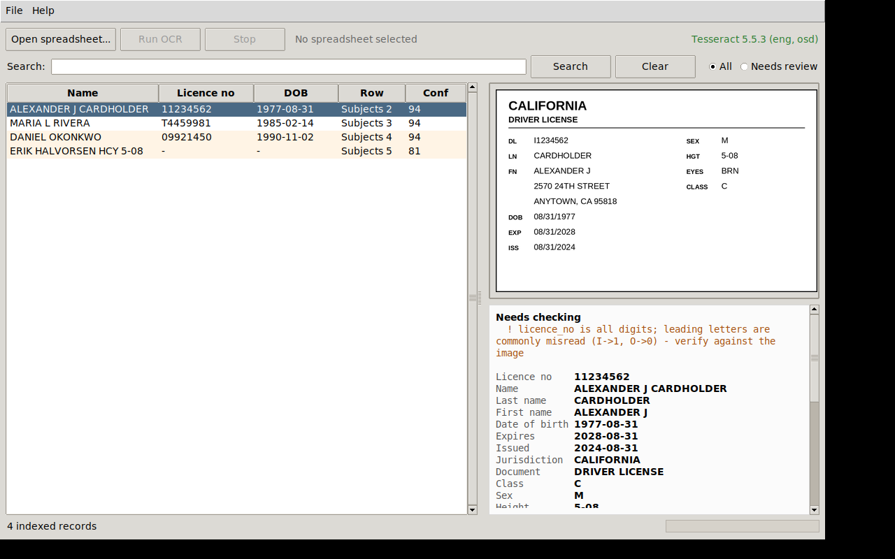

# Tessy

OCR driver's licences out of a case spreadsheet and index the extracted text so
it can be searched.

Everything runs locally. The spreadsheet, the images, the OCR output and the
index never leave the machine — there is no network call anywhere in the
pipeline, and the index is a single SQLite file you can archive with the rest of
the case material.

---

## What it does

```
case.xlsx ──▶ ingest ──▶ preprocess ──▶ Tesseract OCR ──▶ parse fields ──▶ SQLite FTS5
  (images +      (rows,      (greyscale,    (best of         (name, DOB,        (searchable
   text)         images)      upscale)       several PSMs)     licence no…)       index)
```

1. **Ingest** — reads each row of the spreadsheet, picking up both the text
   columns and the licence images (embedded pictures *or* a column of file
   paths — both are auto-detected).
2. **Preprocess** — greyscale, upscale and contrast-normalise each scan.
   Tesseract is trained on ~300 DPI text, so upscaling small crops is the single
   biggest accuracy win.
3. **OCR** — runs Tesseract in several page-segmentation modes and keeps the
   most confident result, with per-word confidence retained.
4. **Parse** — pulls out licence number, name, DOB, expiry, address,
   jurisdiction and the physical descriptors.
5. **Index** — writes everything to SQLite FTS5, so both the OCR text and the
   spreadsheet's own notes are searchable together.

---

## Desktop app



Run it from a checkout:

```bash
make gui                      # or: .venv/bin/tessy-gui
.venv/bin/tessy-gui path/to/case.db
```

...or build a **double-clickable app** that needs nothing installed — see
[Packaging](#packaging-a-double-clickable-app) below.

The window is built around the thing a terminal cannot do: showing the licence
image beside the fields read off it. In the screenshot the image reads
`I1234562` while the extracted field says `11234562` — the examiner sees the
misread immediately, with the warning directly above it.

- **Open spreadsheet → Run OCR** — runs in the background with a progress bar
  and a working **Stop** button. Stopping keeps whatever was already indexed.
- **Search** — the same full-text search as the CLI, including the
  confusion-folded licence-number matching.
- **Needs review** — filters to flagged records, worst first. Flagged rows are
  tinted in the list, and their warnings appear above the fields.
- **File → Export CSV** — the extracted fields for the whole index.

It uses Tkinter, which ships with Python and opens **no socket and no server** —
for tooling that handles identity documents, having nothing listening is the
point. On most Linux distributions Tkinter is packaged separately:

```bash
sudo apt install python3-tk      # Debian/Ubuntu
sudo dnf install python3-tkinter # Fedora
```

macOS and Windows builds from python.org already include it. The app tells you
exactly this if it is missing.

---

## Quick start

### 1. Build Tesseract

```bash
./scripts/build_tesseract.sh
```

Builds Tesseract 5.5.3 from source, installs it into `/usr/local`, **and
installs the language models**. Options:

```bash
PREFIX="$HOME/.local" ./scripts/build_tesseract.sh   # no sudo
TESSERACT_VERSION=5.5.0 ./scripts/build_tesseract.sh
TESSDATA_LANGS="eng osd spa" ./scripts/build_tesseract.sh
TESSDATA_FLAVOUR=fast ./scripts/build_tesseract.sh   # smaller/faster models
```

> **The one thing people get wrong.** Building Tesseract from source gives you
> the binary but **no language data**. A fresh build reports
> `List of available languages (0)` and every OCR call fails. This script
> installs `eng` and `osd` for you and size-checks the downloads, because a
> failed fetch writes a small HTML error page that Tesseract will happily list
> as a "language" and then choke on at runtime.

Already have Tesseract from your package manager? Skip this step — anything
5.x works. Point Tessy at a specific binary with `TESSERACT_BIN=/path/to/tesseract`.

### 2. Install Tessy

```bash
make install-dev
make doctor
```

`doctor` should print your Tesseract version, the installed languages and the
Python dependencies. Fix anything it flags before going further.

### 3. Run it

```bash
# Drop your spreadsheet in, then either launch the desktop app:
make gui

# ...or use the CLI:
.venv/bin/tessy ingest data/input/case.xlsx --db data/output/case.db

# Search it
.venv/bin/tessy search "SMITH"           --db data/output/case.db
.venv/bin/tessy search I1234562          --db data/output/case.db
.venv/bin/tessy search "AUSTIN"          --db data/output/case.db

# What needs a human eye
.venv/bin/tessy review --db data/output/case.db

# Get the extracted fields back out
.venv/bin/tessy export --db data/output/case.db -o extracted.csv
```

### Packaging a double-clickable app

```bash
make app        # -> dist/Tessy.app (macOS), dist/Tessy.exe (Windows), dist/tessy (Linux)
```

The result is self-contained: **Tesseract, its language data and Python are all
inside**. Hand the file to someone with nothing installed and it runs. Roughly
135 MB, which is the price of not asking an investigator to build Tesseract.

PyInstaller cannot cross-compile, so each platform must be built on itself. CI
does all three on native runners — `workflow_dispatch`, a `v*` tag, or a commit
message containing `[package]` — and uploads them as artifacts.

Two flags matter on a packaged app, because the machine running it may have no
terminal-savvy owner:

```bash
Tessy --doctor     # what it found: bundled Tesseract, languages, tkinter
Tessy --selftest   # renders text, OCRs it, checks it round-trips
```

`--selftest` is the one to ask for when someone reports "it doesn't work". It is
also the CI gate: a build that produces a file which cannot OCR is worse than no
build at all. That gate has already earned its place — an early build shipped
the language models but not `tessdata/configs`, so Tesseract silently ignored
the TSV request, emitted plain text, exited 0, and every document came back
empty at 0.0 confidence.

#### Running the macOS app

The `.app` is **unsigned**, so Gatekeeper blocks a plain double-click the first
time. Either right-click the app and choose **Open** (then confirm), or:

```bash
xattr -dr com.apple.quarantine /Applications/Tessy.app
```

CI's `macos-latest` runner is **Apple Silicon**, so the artefact it publishes is
arm64-only and will not launch on an Intel Mac. For Intel, build on an Intel Mac
with `make app`, or add an `x86_64` runner to the matrix.

Confirm a downloaded build before trusting it:

```bash
/Applications/Tessy.app/Contents/MacOS/Tessy --selftest
```

To build against the operator's own Tesseract instead of bundling one:

```bash
TESSY_BUNDLE_TESSERACT=0 make app
```

---

## Spreadsheet layout

Both common layouts work, and a single sheet can mix them.

**Embedded images** — pictures pasted into cells:

| Case Ref  | Subject Notes          | Licence Image   |
|-----------|------------------------|-----------------|
| CASE-1002 | Interviewed 12/03      | *(pasted image)*|

**Path column** — a column of file paths, absolute or relative to the spreadsheet:

| Case Ref  | Notes            | Scan Path               |
|-----------|------------------|-------------------------|
| CASE-3001 | Field referral   | `scans/subject_a.png`   |

Rules:

- Row 1 is the header by default (`--header-row N` to change it).
- Every non-image cell becomes searchable text, tagged with its column heading.
- A row with no image is still indexed on its text alone.
- A path that doesn't resolve is kept as text rather than silently dropped, so
  you can see the broken reference.
- `--sheet NAME` restricts the run to one worksheet.

---

## Commands

| Command | Purpose |
|---------|---------|
| `tessy doctor` | Check the Tesseract install and Python deps |
| `tessy ingest SHEET --db DB` | OCR a spreadsheet and index it |
| `tessy search TERMS --db DB` | Full-text search (`--json` for machine output) |
| `tessy show ID --db DB` | Print one indexed document in full |
| `tessy review --db DB` | List documents needing a human check |
| `tessy stats --db DB` | Index summary |
| `tessy export --db DB` | Export extracted fields as CSV or JSON |
| `tessy-gui [DB]` | Launch the desktop app |
| `tessy-gui --doctor` | Diagnostics, no window (works on a packaged app) |
| `tessy-gui --selftest` | Prove OCR works end to end |

---

## Accuracy, and why `review` matters

OCR on identity documents is good, not perfect. Treat the output as a search
aid and a first pass, **not** as verified data — anything going into a case
record should be confirmed against the image.

Two behaviours are built around this:

**Glyph confusion in licence numbers.** Tesseract reliably confuses `I`/`1`,
`O`/`0`, `S`/`5`, `B`/`8`. In testing, a licence number `I1234562` was read as
`11234562`. Rather than guess, every identifier is also indexed in a
*confusion-folded* form, so searching either spelling finds the record:

```bash
tessy search I1234562   # finds it even though OCR recorded 11234562
```

The parser also flags an all-digit licence number as suspicious, since leading
letters are the most common casualty.

**`tessy review`** lists every document with low OCR confidence, a parser
warning, or a missing licence number — the queue of things worth eyeballing:

```
#3  MARIA L RIVERA   conf: 52.4
    image: data/output/work/Licences_r3_1.png
    ! licence_no is all digits; leading letters are commonly misread
```

If results are poor across the board, the scans are usually the problem. Aim for
300 DPI or better, and try `--psm` to force a segmentation mode
(`--psm 6` for a tidy block of text, `--psm 11` for scattered fields).

---

## Handling case data

Driver's licences are personal data; treat the working directory as evidence.

- **`data/` is gitignored**, as are `*.xlsx`, `*.csv` and `*.db`. Case material
  should never reach the repository. Check `git status` before committing.
- The pipeline extracts embedded images to a working directory
  (`--workdir`, default `<db dir>/work`). Those are copies of the licence
  scans — clean them up when the case closes.
- Nothing is transmitted anywhere. No telemetry, no cloud OCR, no model API.
- The test suite uses **synthetic** generated licences (`tests/synthetic.py`),
  so no real documents are needed to develop or run CI.

---

## Development

```bash
make install-dev    # set up the venv
make test           # full suite
make test-unit      # only tests that don't need Tesseract
make test-gui       # full suite under a virtual display (headless Linux)
make coverage       # with a coverage report
make lint           # ruff
make format         # auto-format
make gui            # launch the desktop app
make app            # build the double-clickable app
```

The suite splits three ways: parsing, indexing, spreadsheet reading and the
desktop app's job runner are pure Python and run anywhere; tests needing the
binary are marked `requires_tesseract`; and the tkinter window tests are marked
`requires_display`. Both skip cleanly when unavailable, so a partial environment
still gives a useful run. Use `make test-gui` (xvfb) to exercise the window on a
headless Linux box.

CI (`.github/workflows/ci.yml`) runs lint, the tesseract-free unit tests across
Python 3.10–3.12, the full suite (including the desktop tests, under xvfb)
against a packaged Tesseract, and a packaging job. The from-source build script is exercised weekly, on demand, or when a
commit message contains `[build-tesseract]` — it's too slow for every push but
too important to leave untested.

---

## Troubleshooting

**`List of available languages (0)` / `Error opening data file …eng.traineddata`**
Language data is missing. Re-run `./scripts/build_tesseract.sh`, or fetch it
manually into `$(tesseract --print-parameters 2>&1 | head -1)`'s tessdata
directory (usually `/usr/local/share/tessdata`).

**`tesseract not found on PATH`**
Either add the prefix to your PATH (`export PATH="/usr/local/bin:$PATH"`) or set
`TESSERACT_BIN=/full/path/to/tesseract`.

**`configure: error: Leptonica 1.74 or higher is required`**
Install the Leptonica headers: `libleptonica-dev` (Debian/Ubuntu),
`leptonica-devel` (Fedora), `leptonica` (Homebrew).

**`… is not a readable .xlsx file`**
Legacy `.xls` isn't supported. Re-save as `.xlsx`.

**`Tessy's desktop app needs tkinter`**
Install it: `sudo apt install python3-tk` (Debian/Ubuntu) or
`sudo dnf install python3-tkinter` (Fedora). The CLI works without it.

**Poor OCR on every image**
Check the scan resolution first, then try `--psm 11` (scattered fields) or
`--no-preprocess` if the images are already clean high-contrast captures.
